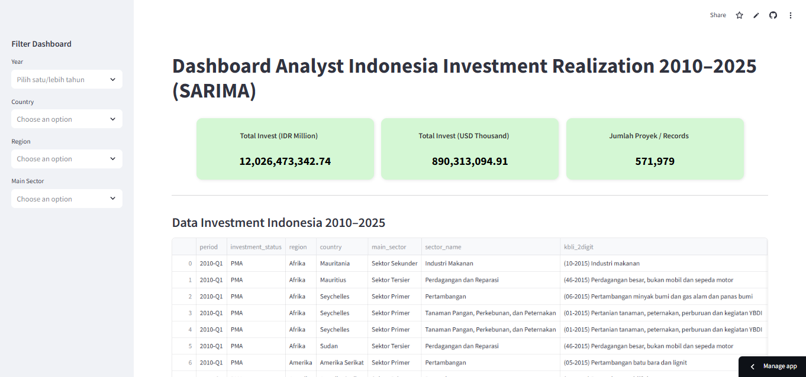

# 📊 Dashboard Analyst Indonesia Investment Realization 2010–2025 (SARIMA)

## 📌 Latar Belakang
Investasi berperan penting bagi pertumbuhan ekonomi Indonesia, baik dari **PMA (Penanaman Modal Asing)** maupun **PMDN (Penanaman Modal Dalam Negeri)**. Investasi yang stabil dan meningkat akan mendorong penciptaan lapangan kerja, meningkatkan daya saing industri, serta mendukung pembangunan infrastruktur.

Dataset ini berisi **data realisasi investasi kuartalan periode 2010–2025**, mencakup negara asal investasi, sektor utama, serta jumlah proyek. Data ini digunakan untuk menganalisis tren jangka panjang sekaligus memodelkan pola musiman investasi.

---

## 📂 Data
- **Periode:** 2010 Q1 – 2025 Q4  
- **Unit:** IDR (Juta Rupiah) & USD (Ribu USD)  
- **Jumlah Proyek/Records:** 571,979  
- **Total Investasi (IDR):** Rp 12,026,473,342.74 juta  
- **Total Investasi (USD):** 890,313,094.91 ribu  

---

## 🔎 Metodologi
Untuk melakukan prediksi investasi, digunakan model **SARIMA (Seasonal AutoRegressive Integrated Moving Average)** karena:  
- Data memiliki **pola tren jangka panjang** (cenderung naik).  
- Data menunjukkan **fluktuasi musiman** pada periode tertentu.  
- Model SARIMA mampu menangkap pola **autoregresi (AR), moving average (MA), differencing (I), dan musiman (S)**.  

Evaluasi model dilakukan dengan **Mean Absolute Error (MAE)**, dan hasilnya:  
- **MAE = 4.32%**  
  → Artinya rata-rata kesalahan prediksi hanya sekitar 4.32% dari nilai aktual, cukup akurat untuk forecasting makroekonomi.  

---

## 📈 Hasil & Visualisasi
### Dashboard Interaktif

### Prediksi & Forecast SARIMA

> 📊 Grafik menunjukkan tren historis, prediksi jangka pendek, dan forecast 8 kuartal ke depan dengan interval kepercayaan 95%.

---

## 🧩 Insight
- Investasi **PMA** masih mendominasi, terutama di sektor **sekunder dan tersier**.  
- Sektor **pertambangan dan industri pengolahan** memberikan kontribusi besar.  
- Prediksi menunjukkan arah **positif hingga 2027**, namun tetap ada volatilitas musiman.  
- Hasil ini bisa digunakan sebagai bahan pertimbangan dalam **perencanaan kebijakan investasi dan pembangunan ekonomi jangka menengah**.  

---

## 🚀 Teknologi & Tools
- **Python** (pandas, matplotlib, statsmodels)  
- **Forecasting Model:** SARIMA  
- **Dashboard Visualization:** Streamlit / Dash  

---

## 📌 Catatan
- Data bersumber dari **BKPM / Badan Koordinasi Penanaman Modal** (kuartalan).  
- README ini dibuat sebagai dokumentasi analisis dan prediksi investasi Indonesia 2010–2025.  

---

✍️ **Author**: Maulana  
